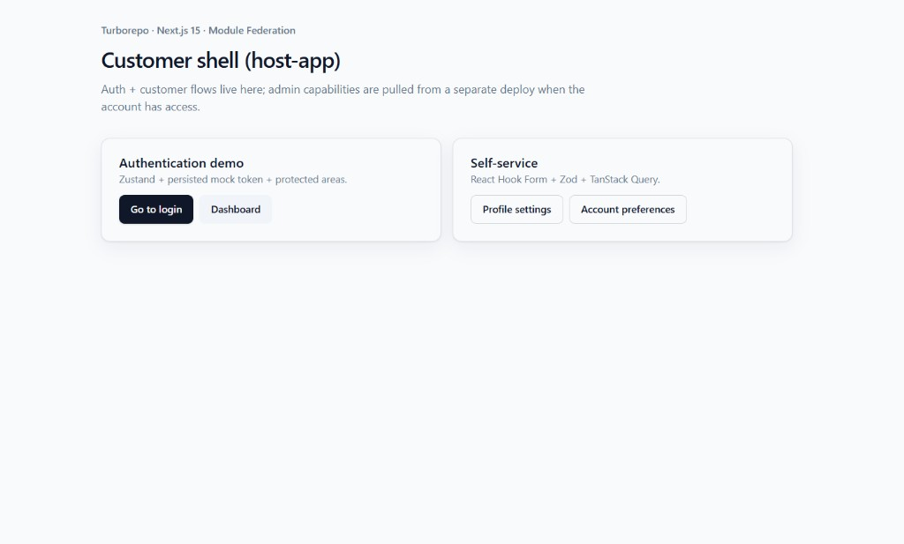
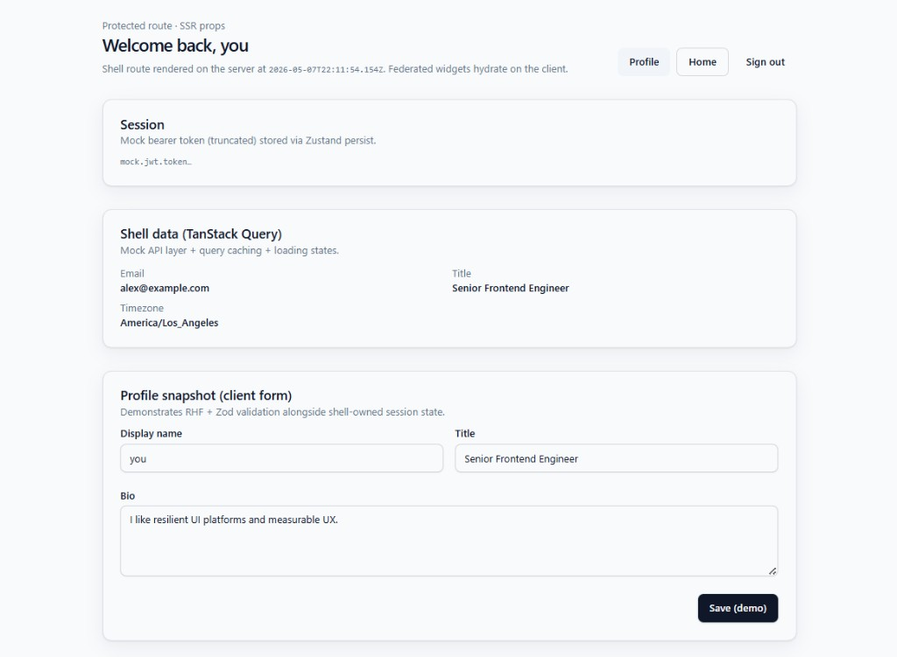

# Enterprise Micro-Frontend Monorepo (Demo)

A production-style frontend platform demonstrating scalable **micro-frontend architecture**, **monorepo design**, and **modern React/Next.js engineering patterns**.

Built as a portfolio project to simulate real-world frontend platform systems used in enterprise environments.

---

## README

pnpm + Turborepo setup: host-app is the shell and admin-app is the federated remote. Shared UI components and basic TS/ESLint configs live in packages/ (@repo/ui, @repo/config).

Auth and scopes are mocked for demo purposes. Tests use Vitest and Playwright, Storybook is used for UI components, and a simple GitHub Actions workflow handles CI.

---

## Screenshots

### Sign in


### Customer shell (home)



### Dashboard



---

## Architecture Overview

- **Host App (`host-app`)**
  Customer-facing shell handling auth, routing, and self-service flows.

- **Remote App (`admin-app`)**
  Exposes federated UI modules consumed at runtime.

- **Shared Packages**
  - `@repo/ui`: reusable design system components
  - `@repo/config`: shared TypeScript, ESLint, utilities

- **Micro-Frontend Strategy**
  Module Federation enables runtime composition and independent deployment of apps.

---

## Key Features

### Platform Capabilities

- Authentication demo (Zustand-based session)
- Scoped access control (feature gating)
- Self-service forms (RHF + Zod)
- Protected dashboard flows

### Frontend Architecture

- Feature-based structure
- Shared UI system
- API abstraction layer
- Error boundaries + loading states
- SSR + dynamic imports

### Engineering Practices

- Monorepo with Turborepo
- CI pipeline (lint, typecheck, test, build, e2e)
- Component documentation (Storybook)
- Unit + E2E testing

---

## Development

Internal context (demo limitations, federation quirks, backlog): [`docs/engineering-notes.md`](docs/engineering-notes.md).

```bash
pnpm install
pnpm dev
```
